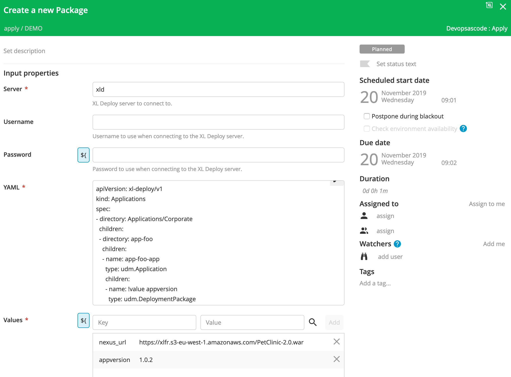

# XL Release DevopsAsCode plugin v1.0.0

[![Build Status][xlr-devops-as-code-plugin-travis-image]][xlr-devops-as-code-plugin-travis-url]
[![License: MIT][xlr-devops-as-code-plugin-license-image]][xlr-devops-as-code-plugin-license-url]
![Github All Releases][xlr-devops-as-code-plugin-downloads-image]

[xlr-devops-as-code-plugin-travis-image]: https://travis-ci.org/xebialabs-community/xlr-devops-as-code-plugin.svg?branch=master
[xlr-devops-as-code-plugin-travis-url]: https://travis-ci.org/xebialabs-community/xlr-devops-as-code-plugin
[xlr-devops-as-code-plugin-license-image]: https://img.shields.io/badge/License-MIT-yellow.svg
[xlr-devops-as-code-plugin-license-url]: https://opensource.org/licenses/MIT
[xlr-devops-as-code-plugin-downloads-image]: https://img.shields.io/github/downloads/xebialabs-community/xlr-devops-as-code-plugin/total.svg

## Preface

This document describes the functionality provided by the XLRelease Devops-as-code plugin.

See the [XL Release reference manual](https://docs.xebialabs.com/xl-release) for background information on XL Release and release automation concepts.  

## Overview

This plugin offers to apply yaml content to an XLDeploy server.
!!! important The 'xl' command is run locally from the XLRelease Server

## Requirements

*  XLRelease Server 9.0.+

Note:  XLD or XLR version should not be lower than lowest supported version.  See <https://support.xebialabs.com/hc/en-us/articles/115003299946-Supported-XebiaLabs-product-versions>.

## Installation

* Copy the [overtherepy jar file](https://github.com/xebialabs-community/overthere-pylib/releases/download/v0.0.4/overtherepy-0.0.4.jar) into the `XL_RELEASAE_SERVER/plugins/__local__` directory.

* Copy the latest JAR file from the [releases page](https://github.com/xebialabs-community/xld-helm-plugin/releases) into the `XL_RELEASE_SERVER/plugins/__local__` directory.
* Restart the XL Deploy server.

## Sample Configuration
A sample configuration is available in the project.

```
$xl apply --xl-release-url http://localhost:5536 -f xebialabs.yaml --values xldeploy_XLDeployServer_xld_password=admin
[1/2] Applying template.yaml (imported by xebialabs.yaml)
    Updated CI Configuration/Custom/Configurationc1f3ece59d0442228c4527f45b1a286a
    Updated CI Applications/Folderef6720f53172432ca0a8fc6becbfb420/Release1fc300aa156644959128d73c0197e4c9

[2/2] Applying xebialabs.yaml
Done
````

## Tasks



## References

